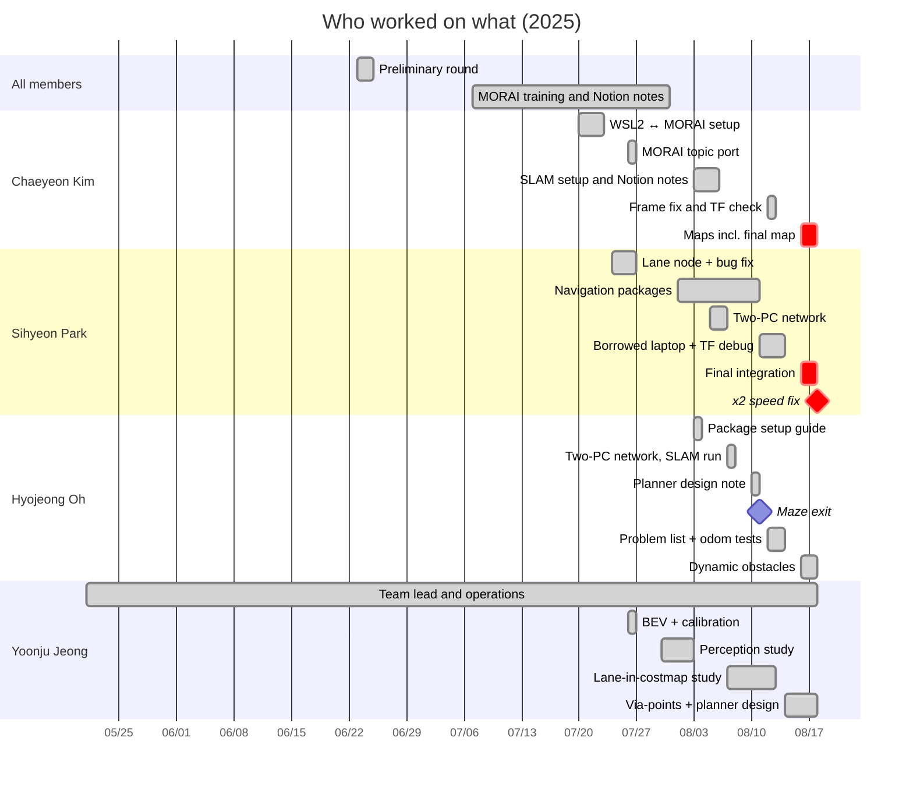

# Team Contributions

[← README](../README.md) · **English** | [한국어](contributions_ko.md)

## At a Glance

| Member | Role | Main deliverables |
|---|---|---|
| **Chaeyeon Kim** @ChaeYeonKim0204 | Environment, SLAM mapping, docs | WSL2 ↔ MORAI setup (the shared PC), MORAI port of the lane node, SLAM setup and Notion notes, final contest map, frame-fix proposal |
| **Sihyeon Park** @kha-2 | Navigation and final integration | first lane node, `wego` / `wego_2d_nav` packages, navigation client, TF/odom debugging, delivery code, ×2 motor multiplier |
| **Hyojeong Oh** @ohhyojeong | Odometry, problem analysis, dynamic obstacles | vehicle package setup guide, first maze exit, problem list and odometry experiments, planner design note, DBSCAN obstacle pipeline |
| **Yoonju Jeong** @yoonju04 | Team lead, camera perception, planner design | BEV + calibration, perception survey, lanes-in-costmap study, TEB via-points design, planner alternatives |

◎ led · ○ actively contributed · △ took part

| | Area | **Chaeyeon Kim** | **Sihyeon Park** | **Hyojeong Oh** | **Yoonju Jeong** |
|---|---|:---:|:---:|:---:|:---:|
| Project | Team operations (meetings, schedule, venues, organizer contact) | ○ | △ | △ | ◎ |
| | Preliminary round (tech stack, plan, architecture, slides) | ◎ | ○ | ○ | ○ |
| | Dev environment and network (WSL2 ↔ MORAI, shared PC, two-PC Ethernet) | ◎ | ○ | ○ | △ |
| Driving stack | Perception (lanes, BEV, traffic light, pedestrians and obstacles) | ○ | ◎ | ○ | ○ |
| | Mapping (SLAM) | ◎ | ○ | ○ | △ |
| | Localization (AMCL, TF, odometry) | ○ | ◎ | ◎ |  |
| | Planning and control (move_base, TEB, costmap, speed) | △ | ◎ | ○ | ○ |
| | Mission logic and integration (navigation client, delivery, final stack) | △ | ◎ | △ |  |
| Common | Documentation (Notion notes, setup guides, GitHub) | ◎ | ○ | ○ | ○ |

All commits on `main` were made from Chaeyeon Kim's account, because Chaeyeon Kim's laptop was the shared PC that ran MORAI and ROS; much of the code inside them was written by teammates, and `Co-authored-by` trailers mark those commits.

Usual workflow: code moved through the team chat, Notion code pages and GitHub; whoever was at the shared PC ran it in MORAI and posted the result. From 08.06 to 08.16 development also ran on Sihyeon Park's laptop and a borrowed laptop, whose workspaces were attached to Notion as snapshots (see [repository workflow](repository.md#workflow)).

## Who Did What, When

| Date | Member | Work | Result |
|---|---|---|---|
| 05.21 | Yoonju Jeong | Found the contest and proposed entering | Team entered |
| 06.23 | Sihyeon Park | Researched control and obstacle avoidance, then took sensors and perception; architecture drafts v1, v2 (SLAM → TF → Nav2, DWB controller) | Architecture for the slides |
| 06.23 – 06.24 | Yoonju Jeong | Coordinated the role split, proposed Q&A prep, wrote the "why virtual validation" argument; **presented** on 06.24 | Result not recorded |
| 06.24 | Chaeyeon Kim | Tech stack (PRM, TEB, YOLO, OpenCV, Behavior Tree, Pure Pursuit) and R&D plan outline; phase-by-phase strategy and presentation script drafted with ChatGPT's help; edited and hosted the shared slides | Presentation material |
| 06.24 | Hyojeong Oh | Risk-handling section (sensor fusion, Behavior Tree condition nodes, slow down / avoid / stop) | Section of the plan |
| 07.07 – 07.08 | Chaeyeon Kim | Shared the MORAI account setup; planned the fallback environment (dual-boot on a spare PC) | Not needed after WSL2 |
| 07.16 | Sihyeon Park | `plothistogram` / `sliding_window` for the SEA:ME hackathon car | Reused in the contest lane node |
| 07.17 | Chaeyeon Kim | Wrapped the PD logic of the Instructables project "Autonomous Lane-Keeping Car Using Raspberry Pi and OpenCV" into `compute_pd_control` for the SEA:ME ROS2 lane node | Its 07.18 version reused in the contest lane node (07.26) |
| 07.20 – 07.23 | Chaeyeon Kim | Found MORAI crashed in a VM (no GPU access); ran MORAI on Windows and ROS Noetic in WSL2 | **Team's standard setup**; this laptop became the shared PC |
| 07.22 | Chaeyeon Kim | Proposed splitting MORAI and ROS across two PCs over Ethernet | Used from 08.06 |
| 07.23 | Yoonju Jeong | Analyzed the lecture's lane pipeline | BEV judged necessary for the virtual camera |
| 07.24 | Sihyeon Park | First lane node: HSV → ROI → sliding windows → steering (`/camera/image_raw` → `/commands/vel`) | Baseline for `lane_following` |
| 07.24 | Yoonju Jeong | Found that the setup had no camera node | Led to using the rosbridge camera topic |
| 07.26 | Chaeyeon Kim | Shared the rosbridge launch command (13:44); ported the 07.24 lane node to MORAI camera/servo/motor topics (14:53); documented the control-topic units (21:42) | First MORAI-connected lane node · speed 300 = 1 km/h, servo 0.5 = straight |
| 07.26 | Sihyeon Park | Yellow-lane mask, `waitKey` and histogram fixes; removed the lane-position check added on 07.24 | **Right lane detected again** |
| 07.26 | Sihyeon Park | First traffic-light stop attempt (`GetTrafficLightStatus`) | Not working (topic typo, stop overwritten by the main loop) |
| 07.26 | Yoonju Jeong | Camera calibration + bird's-eye-view transform | `bird` commit (dropped the same evening, reason not recorded) |
| 07.29 | Chaeyeon Kim | WSL ↔ Windows network guide (key step: `netsh portproxy 9090` for rosbridge) | Used to connect ROS in WSL2 to MORAI |
| 07.29 – 07.31 | Sihyeon Park, Hyojeong Oh | Offline training; asked the instructor about the absolute-position ban | Instructor suggested camera-based driving; team kept SLAM + AMCL + waypoints |
| 07.30 | Hyojeong Oh | Shared and test-ran the instructor's HOG pedestrian-detection example | Too slow for real time |
| 07.30 | Yoonju Jeong | Looked up HOG (~5 fps) vs YOLOv4 (~70 fps) figures | Deep-learning direction chosen (not implemented) |
| 08.01 – 08.10 | Sihyeon Park | `wego` / `wego_2d_nav` skeleton, coordinate conversion, waypoint resampling, first navigation client | Navigation stack (branch `history/sihyeon-laptop-2025-08`) |
| 08.03 | Chaeyeon Kim | Static TF from the rulebook's sensor positions (imu 0, 0, 0.12 · lidar 0.11, 0, 0.13) and `pub_odom` launch for gmapping | SLAM setup committed |
| 08.03 | Hyojeong Oh | Lecture 6 setup guide (static TF, `convert_lidar`, `pub_odom`); MGeo publisher example | Applied to the repository the same day |
| 08.03 | Yoonju Jeong | First `slam_gmapping` run | Map quality poor (checked 08.04) |
| 08.03 – 08.06 | Chaeyeon Kim | After the overlapping maps, re-studied the Day 7 lecture; wrote the SLAM setup steps (packages, launch, what to comment out) in Notion and set the gmapping parameters | Prepared before the first usable map (08.07) |
| 08.05 | Hyojeong Oh | Suggested checking the LiDAR TF position | Input to SLAM debugging |
| 08.06 | Sihyeon Park, Yoonju Jeong | Two-PC Ethernet attempt | Connected, but `rostopic list` empty |
| 08.07 | Sihyeon Park, Hyojeong Oh | Two-PC link working with all topics; SLAM map rebuilt after the first was lost (Sihyeon Park mapping, Hyojeong Oh driving) | Map for 08.07 – 08.15 driving |
| 08.07 – 08.13 | Yoonju Jeong | Lanes as costmap obstacles | **Shown to fail with multiple and crossing lanes** |
| 08.10 | Hyojeong Oh | Global planner design note: chain per-segment Dijkstra, waypoints only where the car must pass, why not TEB via-points | Planning approach documented |
| 08.11 | Chaeyeon Kim | Compared our config with the Day 8 lecture | Found missing costmap settings (applied 08.12, no speed change) |
| 08.11 | Sihyeon Park | Moved to a borrowed laptop and fixed the build; traced how TEB produces `cmd_vel` | Still slow → performance hypothesis dropped |
| 08.11 | Hyojeong Oh | Drove the maze with maze-only goals; raising `max_vel_x` did nothing | **First maze exit · first clue to the TEB bug** |
| 08.12 | Hyojeong Oh | Listed the three open problems (local plan, `/odom` jumping while stopped, `base_link` TF); rqt parameter analysis | Screenshots later proved TEB was on defaults |
| 08.12 | Chaeyeon Kim | Proposed switching the frame from `map` back to `odom`; spotted in the rqt TF view that `base_link` was not connected | TF jitter gone; explained why odometry stopped updating |
| 08.12 | Sihyeon Park | Main executor of TF/odom/localization debugging (applied the frame change, tested, reported) | Jitter gone, then tracking recovered; speed still low |
| 08.13 | Hyojeong Oh | `pub_odom.py` vs dual EKF vs `publish_tf: false` | Trade-offs documented (accuracy vs TF jitter vs disconnected TF) |
| 08.13 | Sihyeon Park | Suspected the global path was too tight; lowered `cost_scaling_factor` | Slight improvement |
| 08.13 | Chaeyeon Kim | Delivery goal: x, y, z → quaternion | Proposed the Euler → quaternion conversion |
| 08.13 – 08.17 | Sihyeon Park | Raised the x, y, z vs quaternion issue; wrote the delivery code | Not integrated |
| 08.14 – 08.16 | Yoonju Jeong | Lane centerline → TEB via-points, centerline publisher | Design (not integrated) |
| 08.14 – 08.18 | Yoonju Jeong | Waypoint, A* and SBPL global planners | Alternatives documented |
| 08.15 – 08.16 | Chaeyeon Kim | Debugged a sudden costmap change on the shared PC | Cause not recorded |
| 08.15 – 08.16 | Yoonju Jeong | Diagnosed the stalls as a planner problem, not a map problem | Focus moved to the planner |
| 08.16 – 08.18 | Sihyeon Park | Ported the stack to the shared PC, built TEB, maze → road client, AMCL tuning | Final contest stack |
| 08.16 – 08.18 | Chaeyeon Kim | 18 gmapping runs, 4 saved maps | **Final map: path-planning failures 17–71 → 0–5 per run** |
| 08.16 – 08.18 | Hyojeong Oh | DBSCAN clustering → velocity → pedestrian/vehicle classification; traffic-light handling | Not integrated |
| 08.18 | Chaeyeon Kim | Re-recorded road waypoints from `/amcl_pose` | `amcl_waypoint_today2.csv` |
| 08.18 15:34 | Sihyeon Park | Uncommented the ×2 motor multiplier | **Car exited the maze ~2.5 min into the next run** |
| throughout | Chaeyeon Kim | Notion notes (Day 7 SLAM/EKF/AMCL, Day 8 Navigation), communication with the organizers, GitHub | Shared knowledge base |
| throughout | Yoonju Jeong | **Team lead**: ran meetings, set schedules and role assignments | Team kept moving |

## Chaeyeon Kim

**Preliminary round**
- Tech stack (PRM, TEB, YOLO, OpenCV, Behavior Tree, Pure Pursuit) and R&D plan outline: roles, goals, strategy, skills, study plan (06.24)
- Drafted the phase-by-phase strategy and the presentation script with ChatGPT's help, edited the slides and hosted the shared deck

**Environment and network**
- Found that MORAI crashes in a VM (no GPU access) → MORAI on Windows + ROS Noetic in WSL2 (07.20–23); this laptop became the team's shared PC
- Proposed the two-PC Ethernet setup (07.22), WSL ↔ Windows network guide with `netsh portproxy 9090` (07.29)

**Perception**
- Wrapped the PD logic of the Instructables project "Autonomous Lane-Keeping Car Using Raspberry Pi and OpenCV" into `compute_pd_control` for the SEA:ME ROS2 lane node (07.17); its 07.18 version was reused in the contest lane node
- Ported the lane node to MORAI camera/servo/motor topics and documented their units (07.26)

**Mapping and localization**
- Static TF from the rulebook's sensor positions and `pub_odom` launch for gmapping (08.03)
- After the first maps overlapped, documented the SLAM setup in Notion and set the gmapping parameters (08.03–06)
- Proposed switching the EKF frame back to `odom` (08.12) → TF jitter gone; found `base_link` disconnected in the rqt TF view
- 18 gmapping runs on the shared PC, **final contest map** (08.18 10:16) → path-planning failures 17–71 → 0–5 per run

**Planning, mission and docs**
- Found costmap settings missing compared with the lecture (08.11)
- Proposed the Euler → quaternion conversion for delivery goals (08.13), re-recorded road waypoints (08.18)
- Notion notes (Day 7 SLAM/EKF/AMCL, Day 8 Navigation), communication with the organizers, GitHub

## Sihyeon Park

**Preliminary round**
- Researched control and obstacle avoidance, then took sensors and perception; system architecture drafts v1 and v2 (06.23)

**Perception**
- `plothistogram` / `sliding_window` for the SEA:ME hackathon car (07.16), first contest lane node (07.24)
- Yellow-lane mask, removed the lane-position check that ignored the right lane, first traffic-light attempt (07.26)

**Environment and network**
- Two-PC Ethernet link: attempt with Yoonju Jeong (08.06), working with Hyojeong Oh (08.07)
- Moved the stack to a borrowed laptop and fixed the build (08.11)

**Mapping, localization and planning**
- `wego` / `wego_2d_nav` skeleton, coordinate conversion, waypoint resampling, first navigation client (08.01–10)
- SLAM map on 08.07, main executor of TF/odom debugging (08.12)
- Traced TEB's `cmd_vel`, lowered `cost_scaling_factor` (08.11–13)

**Mission and integration**
- Delivery code (08.13–17, not integrated)
- Ported the stack back to the shared PC, built TEB, maze → road client, AMCL tuning (08.16–18)
- **×2 motor multiplier on contest day** (08.18 15:34) → car out of the maze

## Hyojeong Oh

**Preliminary round**
- Risk-handling section: sensor fusion, Behavior Tree condition nodes, slow down / avoid / stop (06.24)

**Environment and mapping**
- Lecture 6 setup guide (static TF, `convert_lidar`, `pub_odom`), applied to the repository the same day (08.03)
- Suggested checking the LiDAR TF position (08.05)
- With Sihyeon Park, got the Ethernet link working and drove the car while the 08.07 map was recorded

**Planning**
- Global planner design note: chain per-segment Dijkstra, waypoints only where needed, why not TEB via-points (08.10)
- **First maze exit** with maze-only goals and the first sign that TEB ignored `max_vel_x` (08.11)

**Localization**
- Listed the open problems: local plan, `/odom` jumping, `base_link` TF; rqt parameter analysis (08.12)
- Compared `pub_odom.py`, dual EKF and `publish_tf: false` (08.13)

**Perception and mission logic**
- Tested the instructor's HOG pedestrian example (07.30), MGeo publisher (08.03)
- DBSCAN clustering → velocity → pedestrian/vehicle classification, traffic-light handling (08.16–18, not integrated)

## Yoonju Jeong

**Team lead**
- Found the contest and proposed entering (05.21), ran the preliminary-round preparation and presented (06.23–24)
- Ran meetings, schedules and role assignments throughout

**Perception**
- Judged BEV necessary for the virtual camera (07.23), found the missing camera node (07.24)
- Camera calibration + bird's-eye view (07.26), HOG vs YOLOv4 survey (07.30)

**Mapping and network**
- First `slam_gmapping` run (08.03), Ethernet attempt with Sihyeon Park (08.06)

**Planning**
- Showed that lanes as costmap obstacles fail with multiple and crossing lanes (08.07–13)
- Designed lane centerline → TEB via-points with a centerline publisher (08.14–16, not integrated)
- Diagnosed the stalls as a planner problem, not a map problem (08.16); compared waypoint, A* and SBPL planners

## Not in the Final Code

| Work | Member | Why it was not used |
|---|---|---|
| Camera lane-following node | Sihyeon Park, Chaeyeon Kim | Fixed throttle, offset steering, crash with one lane; the final run followed waypoints instead |
| Traffic-light stop | Sihyeon Park (07.26), Hyojeong Oh (08.18) | Misspelled topic names, stop command overwritten or never consumed, stop on green |
| Delivery mission | Sihyeon Park | Undefined variables in the final version; 2.0 m reach radius vs the rule's 1.2 m; never run in MORAI |
| Dynamic obstacles (DBSCAN, classification) | Hyojeong Oh | Detection only, no stop logic; not merged |
| Yellow-lane mask, BEV + calibration | Sihyeon Park, Yoonju Jeong | Lane node not used; BEV dropped the same evening (reason not recorded) |
| Lane centerline → TEB via-points | Yoonju Jeong | Design not integrated before the contest |
| Waypoint / A* / SBPL planners | Yoonju Jeong (research also by Chaeyeon Kim) | Alternatives only; GlobalPlanner kept |
| Coordinate conversion, waypoint resampling | Sihyeon Park (branch `history/sihyeon-laptop-2025-08`) | Replaced by road waypoints recorded from `/amcl_pose` |

## Sources and Caveats

- Evidence: team chat (07.20 – 08.18), Notion pages and code pages, both git repositories, workspace snapshots attached to Notion, the shared PC's edit history and ROS logs, the official rulebook and network guide, the SEA:ME hackathon chat for the preliminary round, and Chaeyeon Kim's recollection where the records are silent
- Chat accounts are not always authors, because some messages were sent from a shared laptop; these cases were checked with the team
- Not in the chat: the run order and results on contest day and the ×2 multiplier come from Chaeyeon Kim's recollection and the shared PC's logs
- The SEA:ME hackathon code reused here (07.16–17) is documented in the team's SEA:ME repository
