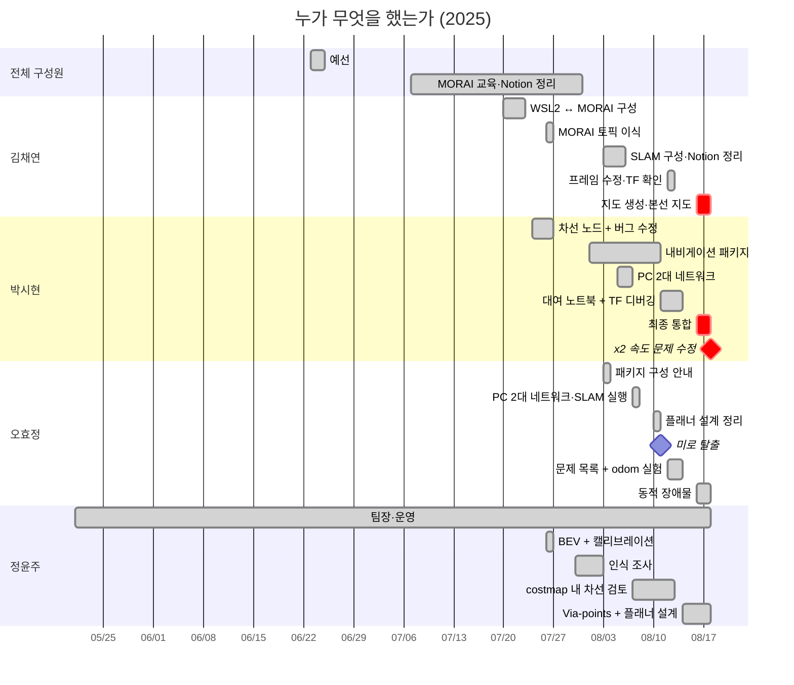

# 팀 기여

[← README](../README_ko.md) · [English](contributions.md) | **한국어**

## 한눈에 보기

| 팀원 | 역할 | 주요 결과물 |
|---|---|---|
| **김채연** @ChaeYeonKim0204 | 환경, SLAM 지도 생성, 문서 | WSL2 ↔ MORAI 구성 (공용 PC), 차선 노드 MORAI 이식, SLAM 구성·Notion 정리, 본선 지도, 프레임 수정 제안 |
| **박시현** @kha-2 | 내비게이션·최종 통합 | 초기 차선 노드, `wego` / `wego_2d_nav` 패키지, 내비게이션 클라이언트, TF/odom 디버깅, 배달 코드, 모터 배율 ×2 |
| **오효정** @ohhyojeong | Odometry, 문제 분석, 동적 장애물 | 차량 패키지 구성 안내, 첫 미로 탈출, 문제 목록·odometry 실험, 플래너 설계 정리, DBSCAN 장애물 파이프라인 |
| **정윤주** @yoonju04 | 팀장, 카메라 인식, 플래너 설계 | BEV + 캘리브레이션, 인식 조사, costmap 차선 연구, TEB via-points 설계, 플래너 대안 |

◎ 주도 · ○ 적극 참여 · △ 참여

| | 영역 | **김채연** | **박시현** | **오효정** | **정윤주** |
|---|---|:---:|:---:|:---:|:---:|
| 프로젝트 | 팀 운영 (회의·일정·장소·대회 측 연락) | ○ | △ | △ | ◎ |
| | 예선 (기술 스택·계획서·구조도·발표 자료) | ◎ | ○ | ○ | ○ |
| | 개발 환경·네트워크 (WSL2 ↔ MORAI·공용 PC·2-PC 이더넷) | ◎ | ○ | ○ | △ |
| 주행 스택 | 인지 (차선·BEV·신호등·보행자·장애물) | ○ | ◎ | ○ | ○ |
| | 지도 작성 (SLAM) | ◎ | ○ | ○ | △ |
| | 위치 추정 (AMCL·TF·odometry) | ○ | ◎ | ◎ |  |
| | 경로 계획·제어 (move_base·TEB·costmap·속도) | △ | ◎ | ○ | ○ |
| | 미션 로직·통합 (navigation client·배달·최종 스택) | △ | ◎ | △ |  |
| 공통 | 문서화 (Notion 정리·설치 가이드·GitHub) | ◎ | ○ | ○ | ○ |

`main`의 모든 커밋은 MORAI·ROS를 실행한 공용 PC가 김채연 노트북이어서 김채연 계정에서 작성됨, 커밋 안의 많은 코드는 팀원이 작성했으며 해당 커밋은 `Co-authored-by` trailer로 표시

평소 작업 방식: 팀 채팅·Notion 코드 페이지·GitHub로 코드 공유 → 공용 PC 사용자가 MORAI 실행·결과 공유, 08.06~08.16에는 박시현 노트북·대여 노트북에서도 개발하고 작업 공간을 Notion에 스냅샷으로 첨부 ([저장소 Workflow](repository_ko.md#workflow))

## 누가 언제 무엇을 했는가

| 날짜 | 팀원 | 작업 | 결과 |
|---|---|---|---|
| 05.21 | 정윤주 | 대회 발견·참가 제안 | 팀 참가 |
| 06.23 | 박시현 | 예선: 제어·장애물 회피 조사 후 센서·인식 담당, 시스템 아키텍처 초안 게시 (v1, v2에 SLAM → TF → Nav2·DWB 컨트롤러 추가) | 슬라이드용 아키텍처 |
| 06.23~06.24 | 정윤주 | 예선: 역할 분담 조율, 질의응답 준비 제안, 가상환경 검증이 필요한 이유 작성, 06.24 **발표** | 결과 기록 없음 |
| 06.24 | 김채연 | 예선: 기술 스택 (PRM, TEB, YOLO, OpenCV, Behavior Tree, Pure Pursuit)·연구개발 계획 개요 (역할·목표·전략·기술·학습 계획) 작성, ChatGPT 도움으로 단계별 전략·발표 대본 초안 작성, 슬라이드 수정·공용 슬라이드 제공 | 06.24 발표 자료 |
| 06.24 | 오효정 | 예선: 위험 대응 절 작성 (센서 융합, Behavior Tree 조건 노드, 감속 / 회피 / 정지) | 계획서 일부 |
| 07.07~07.08 | 김채연 | 팀 MORAI 계정 구성 공유, 예비 환경 계획 (예비 PC 듀얼부팅) | WSL2 도입 후 불필요 |
| 07.16 | 박시현 | SEA:ME 해커톤 차량용 `plothistogram` / `sliding_window` 작성 | 대회 차선 노드에 재사용 |
| 07.17 | 김채연 | Instructables "Autonomous Lane-Keeping Car Using Raspberry Pi and OpenCV" 프로젝트의 PD 로직을 SEA:ME ROS2 차선 노드용 `compute_pd_control` 함수로 구성 | 07.18 버전을 대회 차선 노드에 재사용 (07.26) |
| 07.20~07.23 | 김채연 | VM의 GPU 접근 불가로 MORAI 종료 확인, Windows에서 MORAI·WSL2에서 ROS Noetic 실행 | **팀 표준 환경** (07.23), 해당 노트북을 공용 PC로 사용 |
| 07.22 | 김채연 | 이더넷 기반 PC 2대로 MORAI·ROS 분리 제안 | 08.06부터 사용 |
| 07.23 | 정윤주 | 강의 차선 파이프라인 분석 | 가상 카메라에 BEV 필요 판단 |
| 07.24 | 박시현 | 초기 차선 노드: HSV → ROI → sliding windows → 조향 (입력 `/camera/image_raw`, 출력 `/commands/vel`) | `lane_following` 기본 코드 |
| 07.24 | 정윤주 | 구성에서 카메라 노드 부재 확인 | rosbridge 카메라 토픽 사용으로 연결 |
| 07.26 | 김채연 | rosbridge 실행 명령 공유 (13:44), 박시현의 07.24 차선 노드를 MORAI 카메라/서보/모터 토픽에 맞게 이식 (14:53), 제어 토픽 단위 정리 (21:42) | MORAI 연동 첫 차선 노드 · 속도 300 = 1 km/h, 서보 0.5 = 직진 |
| 07.26 | 박시현 | 노란 차선 마스크, `waitKey`·히스토그램 수정, 07.24 추가한 차선 위치 검사 제거 | **오른쪽 차선 검출 복구** |
| 07.26 | 박시현 | 첫 신호등 정지 시도 (`GetTrafficLightStatus`) | 아직 동작 불가 (토픽 오타, 메인 루프가 정지 명령 덮어씀) |
| 07.26 | 정윤주 | 카메라 캘리브레이션 + BEV 변환 | `bird` 커밋 (같은 날 저녁 제외, 이유 기록 없음) |
| 07.29 | 김채연 | WSL ↔ Windows 네트워크 안내 (핵심: rosbridge용 `netsh portproxy 9090`) | WSL2의 ROS와 MORAI 연결에 사용 |
| 07.29~07.31 | 박시현, 오효정 | 오프라인 교육, 오효정과 강사에게 절대좌표 금지 규칙 문의 | 강사 카메라 기반 주행 제안, 팀은 SLAM + AMCL + waypoint 유지 |
| 07.30 | 오효정 | 강사의 HOG 보행자 검출 예제 공유·실험 | 실시간 처리에 너무 느림 |
| 07.30 | 정윤주 | HOG (약 5 fps) vs YOLOv4 (약 70 fps) 수치 조사 | 인식의 딥러닝 방향 선택 (미구현) |
| 08.01~08.10 | 박시현 | `wego` / `wego_2d_nav` 기본 구조, 좌표 변환, waypoint 재샘플링, 초기 내비게이션 클라이언트 | 내비게이션 스택 구성 (브랜치 `history/sihyeon-laptop-2025-08`) |
| 08.03 | 김채연 | 규정서 센서 위치에 따른 gmapping용 static TF (imu 0, 0, 0.12 · lidar 0.11, 0, 0.13)·`pub_odom` launch | SLAM 구성 커밋 |
| 08.03 | 오효정 | Lecture 6 구성 안내 (static TF, `convert_lidar`, `pub_odom`), MGeo publisher 예제 | 같은 날 저장소 반영 |
| 08.03 | 정윤주 | 첫 `slam_gmapping` 실행 | 지도 품질 불량 (08.04 확인) |
| 08.03~08.06 | 김채연 | 지도 겹침 후 Day 7 강의 재학습, Notion에 SLAM 구성 절차 (패키지·launch·주석 처리 대상) 정리·gmapping 파라미터 설정 | 첫 사용 가능한 지도 생성 (08.07) 전 준비 |
| 08.05 | 오효정 | LiDAR TF 위치 확인 제안 | SLAM 디버깅에 참고 |
| 08.06 | 박시현, 정윤주 | 이더넷 기반 PC 2대 연결 시도 | 연결 성공, `rostopic list` 비어 있음 |
| 08.07 | 박시현, 오효정 | PC 2대 연결·전체 토픽 동작 확인, 첫 지도 유실 후 SLAM 지도 재생성 (박시현 지도 작성, 오효정 주행) | 08.07~08.15 주행용 지도 |
| 08.07~08.13 | 정윤주 | 차선을 costmap 장애물로 처리 | **다중·교차 차선에서 실패 확인** |
| 08.10 | 오효정 | 전역 플래너 설계 정리: 구간별 Dijkstra 연결, 필수 통과 지점에만 waypoint, TEB via-points를 쓰지 않는 이유 | 경로 계획 방식 문서화 |
| 08.11 | 김채연 | 팀 설정과 Day 8 강의 비교 | 누락된 costmap 설정 확인 (08.12 적용, 속도 변화 없음) |
| 08.11 | 박시현 | 대여 노트북 이전·빌드 수정, TEB의 `cmd_vel` 생성 과정 추적 | 여전히 저속 → 성능 가설 제외 |
| 08.11 | 오효정 | 미로 전용 목표로 미로 주행, `max_vel_x` 상향 효과 없음 | **첫 미로 탈출 · TEB 버그의 첫 단서** |
| 08.12 | 오효정 | 미해결 문제 3개 정리 (지역 경로, 정지 중 `/odom` 튐, `base_link` TF), rqt 파라미터 분석 | 이후 스크린샷으로 TEB 기본값 사용 입증 |
| 08.12 | 김채연 | 프레임 `map` → `odom` 복구 제안, 이후 rqt TF에서 `base_link` 연결 끊김 확인 | TF 떨림 해소, odometry 갱신 중단 원인 설명 |
| 08.12 | 박시현 | TF/odom/위치 추정 디버깅 주 실행자 (프레임 변경 적용·실험·보고) | 떨림 해소 후 위치 추적 복구, 여전히 저속 |
| 08.13 | 오효정 | `pub_odom.py` vs 듀얼 EKF vs `publish_tf: false` | 장단점 문서화 (정확도 vs TF 떨림 vs TF 연결 끊김) |
| 08.13 | 박시현 | 전역 경로가 너무 좁다는 가설, `cost_scaling_factor` 하향 | 소폭 개선 |
| 08.13 | 김채연 | 배달 목표 x, y, z → quaternion | Euler → quaternion 변환 제안 |
| 08.13~08.17 | 박시현 | x, y, z와 quaternion 문제 제기, 배달 코드 작성 | 미통합 |
| 08.14~08.16 | 정윤주 | 차선 중심선 → TEB via-points, 중심선 publisher | 설계 (미통합) |
| 08.14~08.18 | 정윤주 | Waypoint, A*, SBPL 전역 플래너 | 대안 문서화 |
| 08.15~08.16 | 김채연 | 공용 PC의 갑작스러운 costmap 변경 디버깅 | 원인 기록 없음 |
| 08.15~08.16 | 정윤주 | 정지 원인을 지도 문제가 아닌 플래너 문제로 진단 | 플래너로 분석 초점 이동 |
| 08.16~08.18 | 박시현 | 공용 PC로 스택 이식, TEB 빌드, 미로 → 도로 클라이언트, AMCL 튜닝 | 본선 스택 |
| 08.16~08.18 | 김채연 | gmapping 18회 실행, 지도 4개 저장 | **본선 지도: 주행당 경로 계획 실패 17–71회 → 0–5회** |
| 08.16~08.18 | 오효정 | DBSCAN 클러스터링 → 속도 → 보행자/차량 분류, 신호등 처리 | 미통합 |
| 08.18 | 김채연 | `/amcl_pose`에서 도로 waypoint 재기록 | `amcl_waypoint_today2.csv` |
| 08.18 15:34 | 박시현 | 모터 배율 ×2 주석 해제 | **다음 주행 시작 약 2.5분 후 미로 탈출** |
| 전 기간 | 김채연 | Notion 정리 (Day 7 SLAM/EKF/AMCL, Day 8 Navigation), 대회 측 연락, GitHub | 공용 지식 자료 |
| 전 기간 | 정윤주 | **팀장**: 회의 진행, 일정·역할 분담 | 팀 작업 지속 |

## 김채연

**예선**
- 기술 스택 (PRM, TEB, YOLO, OpenCV, Behavior Tree, Pure Pursuit)·연구개발 계획 개요: 역할·목표·전략·기술·학습 계획 (06.24)
- ChatGPT 도움으로 단계별 전략·발표 대본 초안 작성, 슬라이드 수정·공용 슬라이드 제공

**환경·네트워크**
- VM의 GPU 접근 불가로 MORAI 종료 확인 → Windows의 MORAI + WSL2의 ROS Noetic (07.20~07.23), 해당 노트북을 공용 PC로 사용
- 이더넷 기반 PC 2대 구성 제안 (07.22), `netsh portproxy 9090`을 포함한 WSL ↔ Windows 네트워크 안내 (07.29)

**인식**
- Instructables "Autonomous Lane-Keeping Car Using Raspberry Pi and OpenCV" 프로젝트의 PD 로직을 SEA:ME ROS2 차선 노드용 `compute_pd_control` 함수로 구성 (07.17), 07.18 버전을 대회 차선 노드에 재사용
- 차선 노드를 MORAI 카메라/서보/모터 토픽에 맞게 이식·단위 정리 (07.26)

**지도 작성·위치 추정**
- 규정서 센서 위치에 따른 gmapping용 static TF·`pub_odom` launch (08.03)
- 초기 지도 겹침 후 Notion에 SLAM 구성 정리·gmapping 파라미터 설정 (08.03~08.06)
- EKF 프레임 `odom` 복구 제안 (08.12) → TF 떨림 해소, rqt TF에서 `base_link` 연결 끊김 확인
- 공용 PC에서 gmapping 18회 실행, **본선 지도** (08.18 10:16) → 주행당 경로 계획 실패 17–71회 → 0–5회

**경로 계획·미션·문서**
- 강의와 비교해 누락된 costmap 설정 확인 (08.11)
- 배달 목표 Euler → quaternion 변환 제안 (08.13), 도로 waypoint 재기록 (08.18)
- Notion 정리 (Day 7 SLAM/EKF/AMCL, Day 8 Navigation), 대회 측 연락, GitHub

## 박시현

**예선**
- 제어·장애물 회피 조사 후 센서·인식 담당, 시스템 아키텍처 초안 v1·v2 (06.23)

**인식**
- SEA:ME 해커톤 차량용 `plothistogram` / `sliding_window` (07.16), 초기 대회 차선 노드 (07.24)
- 노란 차선 마스크, 오른쪽 차선을 무시하던 차선 위치 검사 제거, 첫 신호등 시도 (07.26)

**환경·네트워크**
- PC 2대 이더넷 연결: 정윤주와 시도 (08.06), 오효정과 정상 연결 (08.07)
- 대여 노트북으로 스택 이전·빌드 수정 (08.11)

**지도 작성·위치 추정·경로 계획**
- `wego` / `wego_2d_nav` 기본 구조, 좌표 변환, waypoint 재샘플링, 초기 내비게이션 클라이언트 (08.01~08.10)
- SLAM 지도 생성 (08.07), TF/odom 디버깅 주 실행자 (08.12)
- TEB의 `cmd_vel` 추적, `cost_scaling_factor` 하향 (08.11~08.13)

**미션·통합**
- 배달 코드 (08.13~08.17, 미통합)
- 공용 PC로 스택 재이식, TEB 빌드, 미로 → 도로 클라이언트, AMCL 튜닝 (08.16~08.18)
- **대회 당일 모터 배율 ×2** (08.18 15:34) → 미로 탈출

## 오효정

**예선**
- 위험 대응 절: 센서 융합, Behavior Tree 조건 노드, 감속 / 회피 / 정지 (06.24)

**환경·지도 작성**
- Lecture 6 구성 안내 (static TF, `convert_lidar`, `pub_odom`), 같은 날 저장소 반영 (08.03)
- LiDAR TF 위치 확인 제안 (08.05)
- 박시현과 이더넷 연결 정상화, 08.07 지도 기록 중 차량 주행

**경로 계획**
- 전역 플래너 설계 정리: 구간별 Dijkstra 연결, 필요한 지점에만 waypoint, TEB via-points를 쓰지 않는 이유 (08.10)
- 미로 전용 목표로 **첫 미로 탈출**, TEB의 `max_vel_x` 미적용 첫 단서 (08.11)

**위치 추정**
- 미해결 문제 정리: 지역 경로, `/odom` 튐, `base_link` TF, rqt 파라미터 분석 (08.12)
- `pub_odom.py`, 듀얼 EKF, `publish_tf: false` 비교 (08.13)

**인식·미션 로직**
- 강사의 HOG 보행자 예제 실험 (07.30), MGeo publisher (08.03)
- DBSCAN 클러스터링 → 속도 → 보행자/차량 분류, 신호등 처리 (08.16~08.18, 미통합)

## 정윤주

**팀장**
- 대회 발견·참가 제안 (05.21), 예선 준비 진행·발표 (06.23~06.24)
- 전 기간 회의·일정·역할 분담 진행

**인식**
- 가상 카메라에 BEV 필요 판단 (07.23), 카메라 노드 부재 확인 (07.24)
- 카메라 캘리브레이션 + BEV (07.26), HOG vs YOLOv4 조사 (07.30)

**지도 작성·네트워크**
- 첫 `slam_gmapping` 실행 (08.03), 박시현과 이더넷 연결 시도 (08.06)

**경로 계획**
- 차선을 costmap 장애물로 처리 시 다중·교차 차선에서 실패 확인 (08.07~08.13)
- 차선 중심선 → TEB via-points·중심선 publisher 설계 (08.14~08.16, 미통합)
- 정지 원인을 지도 문제가 아닌 플래너 문제로 진단 (08.16), waypoint·A*·SBPL 플래너 비교

## 최종 코드 미포함 작업

| 작업 | 팀원 | 미사용 이유 |
|---|---|---|
| 카메라 차선 추종 노드 | 박시현, 김채연 | 고정 스로틀, 조향 오프셋, 차선 1개일 때 종료, 본선은 waypoint 추종 |
| 신호등 정지 | 박시현 (07.26), 오효정 (08.18) | 토픽명 오타, 정지 명령 덮어쓰기·미소비, 초록불에 정지 |
| 배달 미션 | 박시현 | 최종 버전의 미정의 변수, 도달 반경 2.0 m (규정 1.2 m), MORAI 실행 이력 없음 |
| 동적 장애물 (DBSCAN, 분류) | 오효정 | 감지만 구현, 정지 로직 없음, 미병합 |
| 노란 차선 마스크, BEV + 캘리브레이션 | 박시현, 정윤주 | 차선 노드 미사용, BEV는 같은 날 저녁 제외 (이유 기록 없음) |
| 차선 중심선 → TEB via-points | 정윤주 | 대회 전 설계 미통합 |
| Waypoint / A* / SBPL 플래너 | 정윤주 (김채연도 조사) | 대안 조사만 진행, GlobalPlanner 유지 |
| 좌표 변환, waypoint 재샘플링 | 박시현 (브랜치 `history/sihyeon-laptop-2025-08`) | `/amcl_pose`에서 기록한 도로 waypoint로 대체 |

## 근거·주의점

- 근거: 팀 채팅 (07.20~08.18), Notion 페이지·코드 페이지, Git 저장소 2개, Notion 첨부 작업 공간 스냅샷, 공용 PC 편집 이력·ROS 로그, 공식 규정서·네트워크 안내, 예선 관련 SEA:ME 해커톤 채팅, 기록이 없는 부분은 김채연 회고
- 공용 노트북에서 전송한 일부 메시지로 인해 채팅 계정과 작성자가 항상 같지는 않음, 해당 사례는 팀 확인
- 채팅에 기록 없음: 대회 당일 주행 순서·결과·×2 배율은 김채연 회고·공용 PC 로그 기준
- 재사용한 SEA:ME 해커톤 코드 (07.16~07.17)는 팀 SEA:ME 저장소에 기록
