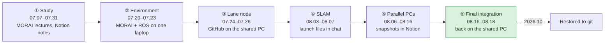
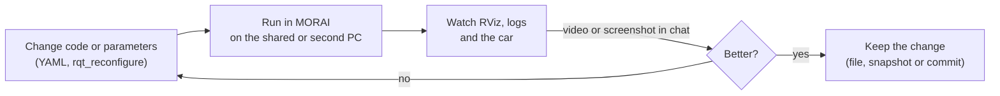

# Repository Guide

[← README](../README.md) · **English** | [한국어](repository_ko.md)

## Folder Tree

```text
Virtual-Autorace-2025/            (catkin workspace src/)
├── README.md / README_ko.md      Project overview (English / Korean)
├── docs/                         Detailed docs: contributions, post-mortem, timeline, this guide
├── CMakeLists.txt                catkin top-level symlink (created by catkin_init_workspace)
│
├── lane_following/               [team] Camera lane following (originally test1_0724)
│   └── script/
│       └── lane_following_node.py    HSV mask → ROI → sliding windows → proportional steering
│
├── wego/                         [team] Vehicle bringup, SLAM and mission control
│   ├── launch/
│   │   ├── teleop.launch             static TF, LiDAR conversion, racecar mux, odom (EKF or pub_odom)
│   │   ├── gmapping.launch           SLAM with slam_gmapping
│   │   └── navigation.launch         map_server + AMCL + move_base + navigation_client
│   ├── scripts/
│   │   ├── navigation_client.py      Maze → Road mission state machine (move_base action client)
│   │   └── pub_odom.py               Broadcasts the odom → base_link TF from the simulator's /odom
│   ├── src/convert_lidar.cpp         Rotates the MORAI LiDAR scan by 180° (swaps the two halves of ranges)
│   ├── maps/                         Final contest map (map.pgm / map.yaml, 0.05 m/px)
│   ├── waypoints/waypoint_1m.csv     Road-section waypoints (~1 m spacing, from /amcl_pose)
│   └── rviz/                         RViz layouts used during mapping and navigation
│
├── wego_2d_nav/                  [team] Navigation configuration
│   ├── launch/amcl.launch            AMCL (likelihood field)
│   ├── launch/move_base.launch       GlobalPlanner + TEB, controller settings
│   ├── params/                       costmap (common/global/local) and TEB parameters
│   └── scripts/cmd_vel_to_ackermann.py   Twist → Ackermann steering (wheelbase 0.26 m)
│
├── morai_settings/               [contest] MORAI scenario, sensor, network and initial-pose settings
├── simulation_contest/           [contest] MORAI messages, rosbridge connector, WeCar messages
│
├── navigation/                   [third-party] ROS navigation stack (move_base, AMCL, costmap_2d, …)
├── teb_local_planner/            [third-party] Timed-Elastic-Band local planner
├── robot_localization/           [third-party] EKF (team-modified example config)
├── slam_gmapping/                [third-party] gmapping SLAM
├── racecar/                      [third-party] Ackermann command mux, teleop (team-modified)
└── vesc/                         [third-party] VESC motor driver interface
```

`[team]` written by our team · `[contest]` provided by the organizers · `[third-party]` open-source packages vendored as-is (sources below).

## Workflow

### How the Workflow Changed



### Phase by Phase

| Phase | Code sharing | Testing | Version control | Division of work | Integration |
|---|---|---|---|---|---|
| ① Study | Notion lecture notes | MORAI Cloud in the training | — | Each member followed the lectures | — |
| ② Environment | Setup guides in chat | MORAI on Windows + ROS in WSL2 | — | Chaeyeon Kim on the setup | Chaeyeon Kim's laptop becomes the shared PC |
| ③ Lane node | Chat + GitHub | Shared PC | Three commits on `main` (07.26) | Lane node, traffic light, BEV in parallel | Only the MORAI port kept |
| ④ SLAM | Launch files pasted in chat, Notion setup notes | Shared PC; two PCs over Ethernet from 08.07 | One commit (08.03) | Setup, mapping and network split among members | Shared PC |
| ⑤ Parallel PCs | Notion code pages, workspace zips attached to Notion | Sihyeon Park's laptop, then a borrowed laptop | No commits on `main`; backup pushed to [kha-2/autonome.github.io](https://github.com/kha-2/autonome.github.io) (08.16) | Navigation, odometry, planner design and maps by different members | On whichever laptop was running |
| ⑥ Final integration | Shared PC directly | Shared PC with MORAI | Commits on 08.17; contest-day edits left uncommitted | Sihyeon Park integrates, Chaeyeon Kim rebuilds the map and waypoints | Sihyeon Park on the shared PC |

### The Test Loop (phases ③–⑥)



- **Worked**: one laptop ran MORAI and ROS, so anyone at it could test; a second PC let two lines of work run at once
- **Cost**: code was spread across the chat, Notion zips and three laptops; nobody checked what a node actually read after a change, so the TEB key typo survived from 08.11 to the contest; the contest-day edits existed only on the shared PC until they were restored here

## Branches & Tags

| Ref | What it contains |
|---|---|
| `main` | Cleaned-up project: contest code + folder restructure + post-contest bug fixes + docs |
| tag `contest-2025-08-18` | Exact code at the end of the final run (before any cleanup) |
| tag `archive/original-history` | The original commit history with the original (Korean) commit messages |
| `history/sihyeon-laptop-2025-08` | Work on Sihyeon Park's laptop: `tf_to_slam` (08.03) → workspace snapshot (08.10) |
| `history/autonome-laptop-2025-08` | Continues on the borrowed laptop: snapshots 08.13 ×2, 08.16, and the 08.16 backup |

The `history/` branches were rebuilt from [kha-2/autonome.github.io](https://github.com/kha-2/autonome.github.io) and workspace snapshots the team attached to Notion, so the parallel development on the second PC (08.06–08.16) can be browsed commit by commit.

The commits on `main` up to the contest keep their original dates and content; only the messages were rewritten in English (each keeps `Original message:`). The contest-day state (tag `contest-2025-08-18`) was committed after the contest from the shared PC's working files, with the time of the last edit.

## Third-party Packages

Vendored at the exact commits below. Each folder was compared file-by-file with its upstream commit; only the listed files differ.

| Folder | Upstream | Commit | License | Team modifications |
|---|---|---|---|---|
| `navigation/` | [ros-planning/navigation](https://github.com/ros-planning/navigation) (noetic-devel) | [`f44bb1f`](https://github.com/ros-planning/navigation/commit/f44bb1fc2810399165115cc98b530fe4b9397c18) | BSD / LGPL | none |
| `teb_local_planner/` | [rst-tu-dortmund/teb_local_planner](https://github.com/rst-tu-dortmund/teb_local_planner) (noetic-devel) | [`b68c328`](https://github.com/rst-tu-dortmund/teb_local_planner/commit/b68c3288a0bca1d4b7c17c5972c2185b08d4cf09) | BSD-3-Clause | none |
| `robot_localization/` | [cra-ros-pkg/robot_localization](https://github.com/cra-ros-pkg/robot_localization) | [`9ef26a5`](https://github.com/cra-ros-pkg/robot_localization/commit/9ef26a57fafd9b97c135a7e07f52cf0168e94178) | BSD | `dual_ekf_navsat_example` launch/yaml: map-frame EKF disabled, 2D mode, 50 Hz, `odom` input |
| `slam_gmapping/` | [ros-perception/slam_gmapping](https://github.com/ros-perception/slam_gmapping) | [`eec8606`](https://github.com/ros-perception/slam_gmapping/commit/eec86068ceb92ebc433b435fe482db14c562f268) | BSD | none |
| `racecar/` | [WeGo-Robotics/racecar](https://github.com/WeGo-Robotics/racecar) (fork of [mit-racecar/racecar](https://github.com/mit-racecar/racecar)) | [`14bd2db`](https://github.com/WeGo-Robotics/racecar/commit/14bd2dba5efc43341b22964cd2014116591cb4be) | BSD | `throttle_interpolator.py` (Python 3; contest-day ×2 motor multiplier, removed on `main`), teleop launch (joystick and static TF includes disabled), `joy_teleop.py` (Python 3 syntax) |
| `vesc/` | [mit-racecar/vesc](https://github.com/mit-racecar/vesc) | [`5127d60`](https://github.com/mit-racecar/vesc/commit/5127d60d8c9cadd2218f49a1b882b3c79710ec3a) | BSD | `vesc_msgs/` removed (replaced by `simulation_contest/wecar_msgs`) |
| `simulation_contest/MORAI-ROS_morai_msgs/` | [MORAI-Autonomous/MORAI-ROS_morai_msgs](https://github.com/MORAI-Autonomous/MORAI-ROS_morai_msgs) | [`6fd5332`](https://github.com/MORAI-Autonomous/MORAI-ROS_morai_msgs/commit/6fd53322f3c812f6818e00644da0d05fb3b50539) | MIT | none |
| `simulation_contest/rospy_rosbridge_connector/`, `simulation_contest/wecar_msgs/`, `morai_settings/` | Provided by the 2025 Virtual Autorace organizers (see also [MORAI-Example_WeGo](https://github.com/MORAI-Autonomous/MORAI-Example_WeGo)) | — | Not stated (`TODO` in `package.xml`); copyright remains with the organizers, included only so the stack can be run | none |
