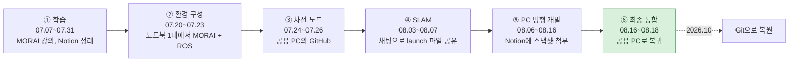
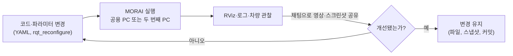

# 저장소 안내

[← README](../README_ko.md) · [English](repository.md) | **한국어**

## 폴더 구조

```text
Virtual-Autorace-2025/            (catkin 작업 공간 src/)
├── README.md / README_ko.md      프로젝트 개요 (영어 / 한국어)
├── docs/                         상세 문서: 기여, 사후 분석, 일정, 이 안내
├── CMakeLists.txt                catkin 최상위 심볼릭 링크 (catkin_init_workspace로 생성)
│
├── lane_following/               [team] 카메라 차선 추종 (기존 test1_0724)
│   └── script/
│       └── lane_following_node.py    HSV 마스크 → ROI → sliding window → 비례 조향
│
├── wego/                         [team] 차량 구동 환경, SLAM·미션 제어
│   ├── launch/
│   │   ├── teleop.launch             static TF, LiDAR 변환, racecar mux, odom (EKF 또는 pub_odom)
│   │   ├── gmapping.launch           slam_gmapping 기반 SLAM
│   │   └── navigation.launch         map_server + AMCL + move_base + navigation_client
│   ├── scripts/
│   │   ├── navigation_client.py      미로 → 도로 미션 상태 머신 (move_base action client)
│   │   └── pub_odom.py               시뮬레이터 /odom에서 odom → base_link TF 발행
│   ├── src/convert_lidar.cpp         MORAI LiDAR 스캔 180° 회전 (ranges의 앞뒤 절반 교환)
│   ├── maps/                         본선 지도 (map.pgm / map.yaml, 0.05 m/px)
│   ├── waypoints/waypoint_1m.csv     도로 구간 waypoint (약 1 m 간격, /amcl_pose 기반)
│   └── rviz/                         지도 생성·내비게이션에서 사용한 RViz 레이아웃
│
├── wego_2d_nav/                  [team] 내비게이션 설정
│   ├── launch/amcl.launch            AMCL (likelihood field)
│   ├── launch/move_base.launch       GlobalPlanner + TEB, controller 설정
│   ├── params/                       costmap (common/global/local)·TEB 파라미터
│   └── scripts/cmd_vel_to_ackermann.py   Twist → Ackermann 조향 (축간 거리 0.26 m)
│
├── morai_settings/               [contest] MORAI 시나리오·센서·네트워크·초기 위치/자세 설정
├── simulation_contest/           [contest] MORAI 메시지, rosbridge connector, WeCar 메시지
│
├── navigation/                   [third-party] ROS navigation stack (move_base, AMCL, costmap_2d, …)
├── teb_local_planner/            [third-party] Timed-Elastic-Band 지역 플래너
├── robot_localization/           [third-party] EKF (팀에서 수정한 예제 설정)
├── slam_gmapping/                [third-party] gmapping SLAM
├── racecar/                      [third-party] Ackermann 명령 mux, teleop (팀 수정)
└── vesc/                         [third-party] VESC 모터 드라이버 인터페이스
```

`[team]` 팀 작성 · `[contest]` 주최 측 제공 · `[third-party]` 원본 그대로 저장소에 포함한 오픈소스 패키지 (출처는 아래 참고)

## Workflow

### Workflow 변화



### 단계별 비교

| 단계 | 코드 공유 | 테스트 | 버전 관리 | 작업 분담 | 통합 |
|---|---|---|---|---|---|
| ① 학습 | Notion 강의 정리 | 교육 중 MORAI Cloud | — | 팀원별 강의 수강 | — |
| ② 환경 구성 | 채팅으로 설정 안내 | Windows의 MORAI + WSL2의 ROS | — | 김채연 환경 구성 | 김채연 노트북을 공용 PC로 사용 |
| ③ 차선 노드 | 채팅 + GitHub | 공용 PC | `main` 커밋 3개 (07.26) | 차선 노드·신호등·BEV 병행 | MORAI 이식본만 유지 |
| ④ SLAM | 채팅에 launch 파일 붙여넣기, Notion 구성 정리 | 공용 PC, 08.07부터 이더넷 기반 PC 2대 | 커밋 1개 (08.03) | 구성·지도 작성·네트워크 분담 | 공용 PC |
| ⑤ PC 병행 개발 | Notion 코드 페이지·작업 공간 zip 첨부 | 박시현 노트북 → 대여 노트북 | `main` 커밋 없음, [kha-2/autonome.github.io](https://github.com/kha-2/autonome.github.io)에 백업 push (08.16) | 내비게이션·odometry·플래너 설계·지도 분담 | 실행 중인 노트북에서 통합 |
| ⑥ 최종 통합 | 공용 PC에서 직접 작업 | MORAI를 실행한 공용 PC | 08.17 커밋, 대회 당일 편집은 미커밋 | 박시현 통합, 김채연 지도·waypoint 재생성 | 박시현이 공용 PC에서 통합 |

### 테스트 루프 (③~⑥단계)



- **효과**: 노트북 1대로 MORAI·ROS 실행 → 사용자가 누구든 테스트 가능, 두 번째 PC로 작업 2개 병행
- **비용**: 코드가 채팅·Notion zip·노트북 3대에 분산, 변경 후 노드가 실제 읽는 값 미확인 → TEB 키 오타가 08.11부터 대회까지 유지, 대회 당일 편집은 이 저장소에 복원하기 전까지 공용 PC에만 존재

## 브랜치·태그

| Ref | 내용 |
|---|---|
| `main` | 정리된 프로젝트: 대회 코드 + 폴더 재구성 + 대회 후 버그 수정 + 문서 |
| 태그 `contest-2025-08-18` | 본선 종료 시점 코드 그대로 (정리 전) |
| 태그 `archive/original-history` | 원본 커밋 이력·원본 한국어 커밋 메시지 |
| `history/sihyeon-laptop-2025-08` | 박시현 노트북 작업: `tf_to_slam` (08.03) → 작업 공간 스냅샷 (08.10) |
| `history/autonome-laptop-2025-08` | 대여 노트북에서 이어진 작업: 08.13 ×2, 08.16 스냅샷·08.16 백업 |

`history/` 브랜치는 [kha-2/autonome.github.io](https://github.com/kha-2/autonome.github.io)와 팀이 Notion에 첨부한 작업 공간 스냅샷으로 재구성, 두 번째 PC의 병행 개발 (08.06~08.16)을 커밋별로 확인 가능

대회까지의 `main` 커밋은 원래 날짜·내용 유지, 메시지만 영어로 변경 (각 메시지에 `Original message:` 보존), 대회 당일 상태 (태그 `contest-2025-08-18`)는 대회 후 공용 PC 작업 파일에서 마지막 편집 시각으로 커밋

## 외부 패키지

아래 커밋 그대로 저장소에 포함, 각 폴더를 upstream 커밋과 파일별로 비교했으며, 명시된 파일만 차이 있음

| 폴더 | Upstream | 커밋 | 라이선스 | 팀 수정 사항 |
|---|---|---|---|---|
| `navigation/` | [ros-planning/navigation](https://github.com/ros-planning/navigation) (noetic-devel) | [`f44bb1f`](https://github.com/ros-planning/navigation/commit/f44bb1fc2810399165115cc98b530fe4b9397c18) | BSD / LGPL | 없음 |
| `teb_local_planner/` | [rst-tu-dortmund/teb_local_planner](https://github.com/rst-tu-dortmund/teb_local_planner) (noetic-devel) | [`b68c328`](https://github.com/rst-tu-dortmund/teb_local_planner/commit/b68c3288a0bca1d4b7c17c5972c2185b08d4cf09) | BSD-3-Clause | 없음 |
| `robot_localization/` | [cra-ros-pkg/robot_localization](https://github.com/cra-ros-pkg/robot_localization) | [`9ef26a5`](https://github.com/cra-ros-pkg/robot_localization/commit/9ef26a57fafd9b97c135a7e07f52cf0168e94178) | BSD | `dual_ekf_navsat_example` launch/yaml: 지도 프레임 EKF 비활성화, 2D 모드, 50 Hz, `odom` 입력 |
| `slam_gmapping/` | [ros-perception/slam_gmapping](https://github.com/ros-perception/slam_gmapping) | [`eec8606`](https://github.com/ros-perception/slam_gmapping/commit/eec86068ceb92ebc433b435fe482db14c562f268) | BSD | 없음 |
| `racecar/` | [WeGo-Robotics/racecar](https://github.com/WeGo-Robotics/racecar) ([mit-racecar/racecar](https://github.com/mit-racecar/racecar)의 fork) | [`14bd2db`](https://github.com/WeGo-Robotics/racecar/commit/14bd2dba5efc43341b22964cd2014116591cb4be) | BSD | `throttle_interpolator.py` (Python 3; 대회 당일 모터 배율 ×2, `main`에서 제거), teleop launch (joystick·static TF include 비활성화), `joy_teleop.py` (Python 3 문법) |
| `vesc/` | [mit-racecar/vesc](https://github.com/mit-racecar/vesc) | [`5127d60`](https://github.com/mit-racecar/vesc/commit/5127d60d8c9cadd2218f49a1b882b3c79710ec3a) | BSD | `vesc_msgs/` 제거 (`simulation_contest/wecar_msgs`로 대체) |
| `simulation_contest/MORAI-ROS_morai_msgs/` | [MORAI-Autonomous/MORAI-ROS_morai_msgs](https://github.com/MORAI-Autonomous/MORAI-ROS_morai_msgs) | [`6fd5332`](https://github.com/MORAI-Autonomous/MORAI-ROS_morai_msgs/commit/6fd53322f3c812f6818e00644da0d05fb3b50539) | MIT | 없음 |
| `simulation_contest/rospy_rosbridge_connector/`, `simulation_contest/wecar_msgs/`, `morai_settings/` | 2025 Virtual Autorace 주최 측 제공 ([MORAI-Example_WeGo](https://github.com/MORAI-Autonomous/MORAI-Example_WeGo)도 참고) | — | 명시 없음 (`package.xml`에 `TODO`), 저작권은 주최 측에 있음, 실행 재현용으로만 포함 | 없음 |
